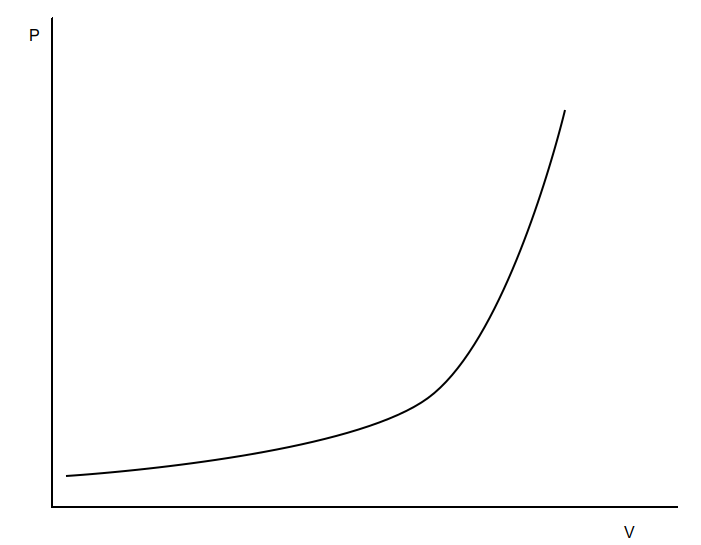
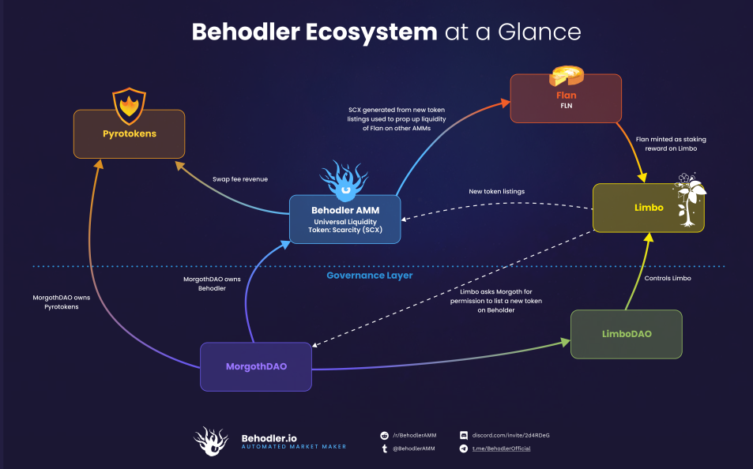

# Welcome to Limbo

Your mission, should you choose to accept it, will be to eliminate all showstopping bugs from the Limbo system and to ensure that no harmful side effects spill into the Behodler AMM. A secondary mission will be to optimize gas in 4 key commonly accessed functions.

This document will outline the scope of the audit. Not everything here is subject to an audit and Limbo has linkages with other parts of the Behodler Ecosystem. Those other parts can be assumed to work perfectly.
We will start with an overview of the Ecosystem, followed by an outline of significant changes since the C4 audit. Where appropriate, we may take excursions into some cryptoeconomics that are distinguish Limbo from other farms and Behdoler AMM from other AMMs. Everything has been built from first principles and only best practices are made use of.

For a video refresher of absolutely everything with emphasis on Limbo, see this <a href ="https://www.youtube.com/watch?v=EEYO0zI3K2c&list=PLmf60JxYYfEvC-_laKFUqKbOrMcz_RQKN&index=1" open="_blank">video</a>.

All of the code was architected, tested and written by Justin Goro.

# Overview

The cryptoeconomics of BehodlerAMM demand special treatment and although, for UX reasons, Limbo resembles a traditional yield farm such as Sushi's Onsen, the featureset of Limbo is fairly unique.

## Motivation for Limbo

### Scarcity understood

Henceforth, Behodler refers to the AMM at the heart of the ecosystem
Behodler is a single sided, multi-token AMM. There is one pool of liquidity both logically and physically. That is, the user sees one pool and all of it is stored in one contract. The number of possible tokens is unlimited. There is one universal liquidity token, Scarcity (SCX) and beyond representing an unlimited selection of pooled tokens, the mint function of Scarcity is logarithmic, instead of proportional.

A swap between 2 tokens follows the standard constant produce xy=k approach. However, unlike LP tokens in Uniswap, the curvature of swaps between 2 tokens on Behodler can be simulated by minting SCX with the input token and redeeming output tokens with the minted SCX. That is, by following logarithmic minting and burning of SCX, we get the same outcome from minting and immediately burning SCX as we do from swapping the 2 tokens without using SCX as an ephemeral intermediate token.
The <a href ="https://github.com/Behodler/behodler2/blob/master/documentation/behodler_whitepaper.pdf" open="_blank">Behodler White paper</a> outlines the mathematics of why this is the case.
What this means is that minting SCX is the equivalent of performing half of a swap and bottling up the potential energy of the remaining half. Burning then releases this trapped potential and the net result is the swap. Contrast this to a standard LP token which simply represents and proportional share of locked liquidity. By imbuing SCX with the innate slippage of the xy=k hyperbola, the price is not proportional. Instead the marginal price of SCX is highest and declines significantly as liquidity is redeemed. Conversely, the rate of the increase in quantity of minted SCX declines as more liquidity is added to Behodler, reflecting as a sharply increasing SCX price.

In the above image, V represents the average value of TVL. That is, the TVL divided by the number of listed tokens. P represents the marginal price of SCX.

### Risks inherent to Scarcity

A consequence of the curvature of SCX is that the first droplets of liquidity added to Behodler yields a disproportionate quantity of Scarcity minted. Consider that adding 1 unit of a new token generates about 600 SCX whereas adding another 9000 generates about 200 SCX. Suppose this 1 token is DAI. If a new token is listed on Behodler for trading with zero liquidity and 10000 units of Dai is added over time, we could get a situation where one person generates 600 SCX from adding 1 Dai and consequently waits for the remaining liquidity to arrive before redeeming 9000 Dai for 200 SCX. This would in effect be a massive redistributional transfer of value between users which is not ideal...

In the Behodler community, this result has been coined the Early Bird Attack.

Another risk concerns the nature of single pool liquidity. Suppose a token is listed on Behodler that gives the creator of the token contract admin minting rights. The creator can now mint enough Scarcity to redeem all the liquidity of all the other tokens. For this reason, open listing such as in Uniswap is not an option on Behodler.

What this means is that Behodler is at risk from sudden bursts of new liquidity (vertical liquidity risk) and from the inherent threats of new tokens (horizontal risk). In light of these risks, Limbo was proposed to address both of these constraints.

Essentially, by nullyfying both the vertical and horizontal risks inherent in Behodler, Limbo allows for a rapid incentivized expansion of Behodler. In the process, a buffet of positive externalities is made possible, including the initially unintentional creation of a stablecoin, Flan, and a price floor mechanism for putting the breaks on impermanent loss without relying on unsustainable minting in the form of Token Proxies.

And so since its proposal, Limbo has evolved from being a tokenomic shield to being a wellspring of liquidity growth and efficiency, manifesting as prosperity through increasing demand generated for the 3 protocol tokens in the Ecosystem.

## Components of the Behodler Ecosystem

### The tokens

EYE is the universal governance token for the Ecosystem. SCX is the liquidity token for Behodler (AMM) and Flan is the reward token minted by Limbo in order to reward liquidity staking. Scarcity burns on transfer. In this way, the regular trade of SCX in other AMMs will decrease the supply which increases the level of liquidity trapped permanently in Behodler. This permanently trapped liquidity is referred to as residual liquidity or the liquidity floor and a secondary purpose of Limbo is to encourage as much SCX lockup and burn as possible in order to grow this floor. For this reason, we don't need to levy a fee on trade in the AMM to grow liquidity because we already have the SCX transfer fee.

### The AMM

Behodler, the AMM has been covered and has a token registration contract, Lachesis, which maintains a list of all tradeable tokens. Lachesis can only be altered through governance action. Every trade on Behodler is charged a 0.5% fee. The fee can be changed through governance to any percentage including zero. The fee is either burnt or send to the PyroToken reserve. Lachesis informs which of these outcomes occurs.

### PyroTokens

Every token that isn't listed as burnable has a corresponding PyroToken in a 1:1 relationship. Eg. Eth has PyroWETH. Each PyroToken has an algorithmic redeem rate starting at 1. If the reserve of the PyroToken increases without a proportional increase in supply, the redeem rate increases. If the supply falls without a reduction in reserves, the redeem rate also rises. A PyroToken can be minted with its base token at the prevailing redeem rate. The base token can be unlocked at the prevailing redeem rate by redeeming the PyroToken which is then burnt.
Whenever a token such as ETH is sold, 0.5% is levied and sent to the corresponding PyroToken reserve. Since SCX's burn mechanism accounts for liquidity growth, the fee on Behodler can be used for other incentives. The other incentive in this case is PyroTokens.
As trade occurs for a token on Behodler, the PyroToken redeem rate for that token rises because of incoming reserve revenue. PyroTokens burn on transfer which has the effect of increasing the redeem rate instantly through a reduction in supply.

PyroTokens therefore provide a hold incentive over their base tokens. If we have a Uniswap LP token composed of a pair of, say, SCX and ETH then if users accumulate its corresponding PyroToken, the demand for the underlying LP token will rise. This will draw liquidity into the SCX/ETH pair. Since SCX burns on transfer, more SCX liquidity means more burning because of reduced slippage and increasing arbitrage opportunities.
PyroTokens therefore represent a secondary liquidity growth strategy for Behodler. In the community, this pulling on SCX burn is called Automining.

### Limbo

Limbo lists tokens for staking. The listed tokens can either follow the standard staking conditions of all liquidity mines. Here a user stakes a token and receives a Flan payout. These pools are called perpetual pools. The other type of pool concerns tokens which the community wants listed on Behodler. Recall that we can't just list a new token on Behodler without preseeding it with liquidity, lest we suffer an Early Bird Attack.

Limbo offers Flan in returning for staking a _threshold_ token. When a certain threshold of staked quantity is reached, withdrawals from Limbo are locked. The entire balance of the token is then injected into Behodler and SCX is generated. Instead of handing out the SCX to the stakers proportionately, they are paid with a _crossover bonus_ in Flan, a compensation payment for having their staked tokens confiscated.

Suppose the SCX generated is worth \$10k. An oracle is consulted and \$10k worth of Flan is minted. It is then coupled with the generated SCX and pooled in the Flan/SCX pool in UniswapV2. This replenishes the liquidity of Flan to enable continued minting of new Flan without suffering a negative price impact.

However, there's an additional step. If the price of Flan has fallen below par with 1 Dai by the time a migration happens, the quantity of Flan minted is less than \$10k worth(in this example). When the Flan and SCX is sent to Uniswap, the unequal ratio skews the Uniswap Pair such that Flan increases in price. This price increase through a liquidity increase is known as price _tilting_. Conversely, if the price of Flan has risen significantly over \$1, more than \$10k Flan is minted in order to bring the price down. Regular migrations keep the Flan price stable. The price volatility of Flan is expected to initially be fairly high but over time decrease until tight 1 Dai price stability is achieved. However, no price guarantees are made, freeing up Limbo from being fragile to black swan price movements.

### LimboDAO

LimboDAO governs Limbo, controlling actions such as which tokens to list, how they're listed, how much each threshold token should require for crossover, which contracts have the right to mint Flan, which contract should govern crossovers and some emergency shutdown measures.

Decisions are either made by lodging and voting on proposals or through an instant governance mechanism known as Flash Governance.

**Proposals**
LimboDAO offers its users non-transferrable voting points called Fate in return for staking EYE or EYE based LP tokens. Fate is generated quadratically in order to dampen whale dominance.
Lodging a proposal has a Fate price. The lodging process deducts twice the lodge price. If the proposal succeeds, half of the Fate is returned to the lodging user, the rest burnt. If not, it is all burnt. This incentivizes against Karen attacks, a griefing attack involving the excessive lodging of proposals.
Fate can also be generated by burning EYE. This yields very high quantities of Fate for those who don't wish to wait.

**Flash Governance**
Some functions in Limbo can be called with small parametric adjustments. This is to allow incentives to be adjusted in response to market movements without having to wait for a long voting period of a proposal. Flash governed methods immediately deduct a large quantity of EYE from the caller as a deposit. If the function call resulted in an undesirable outcome, the community can vote to have the deposit burnt. If no such vote is carried out, after a cooldown period, the caller can withdraw their EYE deposit.
Flash governance is also useful for pausing Limbo if an attack is detected.

### MorgothDAO (beyond the scope of the audit)

The Behodler Ecosystem is governed through a DAO of DAOs approach. Morgoth is the DAO prime which takes meta governance decisions such as which DAO should govern which Dapp. The sub DAOs such as LimboDAO are referred to as microDAOs. Morgoth acts as a supreme court of sorts whereas each DAO has its own consensus mechanisms appropriate to the task at hand and so are analogous to States in a Federal republic or provinces of an Empire, depending on whether the reader is American/Swiss (Federation oriented) or Chinese/Roman (Provincial Imperial).

# Significant changes since the C4 Audit

While the overview and dynamics are the same, there have been a few security improvements.

## Oracles

Previously there was a lightweight price stamping mechanism that C4 wardens rightly determined may result in significant griefing. It has since been replaced with an oracle contract relying on the UniswapV2 TWAP system. The latest price isn't essential. Rather a robust price is more important.

Sometimes it is necessary to know the balance of a token within an pool. For instance, instead of knowing the price of SCX from SCX/Flan, we may want to know how much Flan is locked in the pool. There is no oracle stamping for this but there is a workaround:
Suppose we create a pool of SCX/(SCX/Flan) where the second token is the LP token generated from SCX/Flan. We take oracle reading of this pool as well. We then list this pool on Behodler and Limbo so that it receives incentives for liquidity addition so that we know the market price is accurate. If we know the price of SCX/Flan in terms SCX from this secondary pool and we know the price of Flan in terms of SCX and we know the total supply of SCX/Flan then we can infer the quantity of Flan locked in SCX/Flan in a tamper proof, robust manner.

## Proxies

Limbo keeps track of staked balances. For this reason, fee-on-transfer tokens and rebase tokens can cause problems with reward calculations. On the Behodler side, some tokens have unlimited minting potential which creates an existential risk to the entire AMM.

The solution has been to create purpose built proxies, wrapper contracts to normalize behaviour, just as Weth was created to ERC20-ify ETH. On the Limbo side, there's a LimboProxy contract which normalizes the behaviour of both rebase and FOT tokens. Then we list the proxy on Limbo, rather than the base and UI developers hide the complexity of wrapping from the end user so that they simply experience staking and unstaking of OUSD, as an example.

On the Behodler side, we have a proxy called CliffFace which can place a lower floor on price. If the price drops below this level, any additional minting steeply raises the redeem rate. What the end user experiences is that when the price falls below this floor, selling on Behodler results in very high slippage. The sales ram up against the cliff face of slippage so that the AMM isn't drained of it's value through an impermanent loss death spiral. Whether for fast rugpulls or slow declines, the CliffFace contract is the ultimate defense necessary to protect the health of a single pool AMM.

There's a tokenProxyRegistry which maps Limbo to Behodler. To understand how this works, consider an example. A Sushi clone is created with an infinite mint token that burns on transfer. We wish to list it on Limbo for migration to Behodler but we're afraid that the infinite mint may endanger the AMM and we know the FOT will mess with Limbo logic.

So the tokenProxyRegistry contract maintains a mapping of baseToken to [CliffFace, LimboProxy]. In other words, Limbo lists the proxy wrapper and when migration happens, the underlying base token is liberated and wrapped in a CliffFace instance which is then listed directly on Behodler.
UI devs then have to ensure that the user is unaware of this proxy wrapping and unwrapping so that all they see is the Sushi clone token.

## Fate transfer contracts

Finally, there exists as a mechanism to give contracts the right to transfer Fate balances. This allows the community to approve contracts which sell Fate which means that we can now create markets for governance, similar to the Curve Wars. Since Fate is generated quadratically, whales have more incentive to buy already generated Fate from fish, rather than to stake their own EYE and as such, this mechanism provides a way for capital to be redistributed from whales to the fish.

A secondary incentive is to increase demand for EYE.

## Emphasis of Audit

Wherever MorgothDAO is referenced (such as in the migration code in UniswapHelper), assume it works. Morgoth is beyond the scope of this audit.

Limbo staking/unstaking need to be as gas efficient as possible.

For the proxies, LimboProxy's stake and unstake also need to be gas efficient. For CliffFace, swapAsInput and swapAsOutput need to be optimized to the bone.

Please don't worry about constructor parameter validation such as zero checks. Only bugs matter.

There's a testnet deployment component which is also beyond the scope. Ignore the directory labelled scripts and if you review unit tests, ignore the Wargames directory. 

This markdown document will self destruct in 5 seconds.